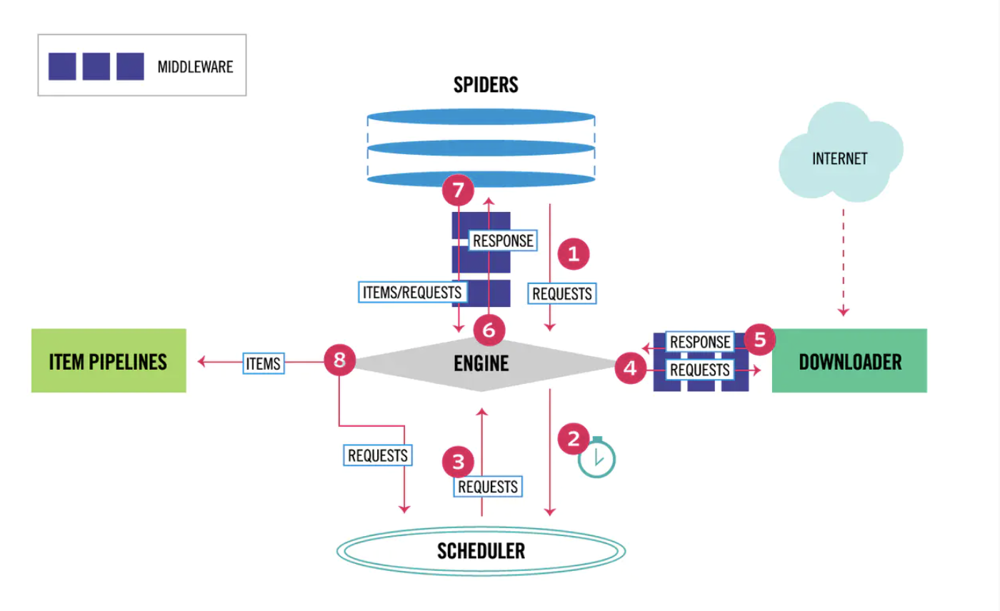

# scrapydemo
scrapy查漏补缺
### Scrapy数据执行流程

scrapy框架数据流 Scrapy中的数据流由执行引擎控制，其过程如下：

1.引擎从Spiders中获取到的最初的要爬取的请求(Requests)。

2.引擎安排请求(Requests)到调度器中，并向调度器请求下一个要爬取的请求(Requests)。

3.调度器返回下一个要爬取的请求(Request)给引擎。

4.引擎从上步中得到的请求(Requests)通过下载器中间件(Downloader Middlewares)发送给下载器(Downloader),这个过程中下载器中间件(Downloader Middlerwares)
中的process_request()函数就会被调用。

5.一旦页面下载完毕，下载器生成一个该页面的Response，并将其通过下载中间件(Downloader Middlewares)中的process_response()函数，最后返回给引擎

6.引擎从下载器中得到上步中的Response并通过Spider中间件(Spider Middewares)发送给Spider处理，这个过程中Spider中间件(Spider Middlewares)
中的process_spider_input()函数会被调用到。

7Spider处理Response并通过Spider中间件(Spider Middlewares)返回爬取到的Item及(跟进的)新的Request给引擎，这个过程中Spider中间件(Spider Middlewares)
的process_spider_output()函数会被调用到。

8.引擎将上步中Spider处理的及其爬取到的Item给Item管道(Piplline),将Spider处理的Requests发送给调度器，并向调度器请求可能存在的下一个要爬取的请求(Requests)

9.(从第二步)重复知道调度器中没有更多的请求(Requests)。

### 信号的执行流程

1.整个运行过程中信号的执行流程 首先我们获取下面两个信号 `spider_opened`和 `engine_started`,爬虫开始和引擎开始的信号。 

2.当一个请求下载完成的时候我们得到 `response_downloaded`
信号，然后请求到达 DownloaderMiddleware 中间件的 `process_response`方法。 此时流程处于 `response_downloaded` 和 `response_received` 信号之间。

3.之后信号`response_received`触发。

4.接下来 SpiderMiddleware 将触发两个方法 `process_spider_input` 和 `process_spider_output`

5.对于每个成功通过ITEM_PIPELINES的item都会触发`item_scraped`信号。

6.如果期间爬虫出现了异常会触发 `spider_error` 信号。 然后每个url请求重复上面的过程。

7.所有请求都完成的时候，触发信号`spider_idle`。 如果此时没有做特殊处理。如果使用了 scrapy-redis 了另当别论 

8.最后爬虫关闭触发信号`spider_closed`,之后引擎也关闭了触发信号`engine_stopped`。
