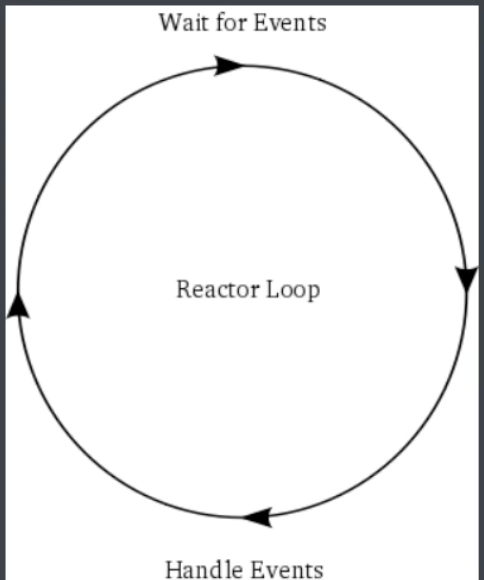

### 简介

Twisted 是 Python基于事件驱动实现的高性能异步网络编程框架，诞生于2000年初，支持python2.7和3.3.是建立在deferred object(通过异步架构实现的机制)之上。Twisted和django/flask等web框架定位不同，在开发中Twisted不适合编写常规的web应用，常用于物联网，有序，爬虫甚至VoIP等底层网络应用，其中像scrapy框架底层就是基于twisted的。

twisted支持所有主流的事件循环机制:select(所有平台)、poll(大部分POSIX平台)、poll（Linux），kqueue(FreeBSD,OSX)、OCP(windows)和各种GUI事件循环机制。还提供了丰富的特性来支持异步编程，如Defer、Threading。

### 事件管理器(reactor)

我们称之为反应堆，实际上就是个死循环。

```python
from twisted.internet import reactor


def main(message):
    print(message)
    reactor.stop()  # 停止运行


if __name__ == '__main__':
    reactor.callWhenRunning(main, "Hello World")
    reactor.run()  # 运行

```

#### 基本原理

reactor，本质上就是一个基于 select,poll或 epoll 的事件循环，在单线程中运行。在编程领域中，这种利用循环体来等待事件发生，然后处理发生的事件的模型非常常见，被设计成为一个设计模式，叫反应器模式或反应堆模式。因为它是等待事件的发生，然后才做出相应的反应的。



reactor 是 twisted 异步框架中的核心组件，是事件管理器，用于注册，注销事件，运行事件循环，当事件发生时调用回调函数处理。

 在 twisted 框架运行的过程中，reactor 时一个基于单例模式实现的对象，它会监听socket 的状态，当socket状态有变化时(有新的连接请求，或接收到数据等)时，调用相应的组件来进行处理，reactor 不断的循环扫描 socket 列表中监听对象的状态，当有特定事件发生时(socket状态变化)调用回调函数 callback，来处理事件，这时候执行权限交给回调函数，当我们的代码处理完事件后，将执行权返回给 reactor，继续进行循环监听。

#### 定时调用

`reactor.callLater` 会将某个任务加入到事件循环，并设置好多少秒后执行，当然要将事件循环启动后才会有作用。

```python
#设置延时调用
call = reactor.callLater(调用时间,回调函数,参数1,参数2....)
# 取消延时调用
call.cancel()
```

  但是callLater只会调用一次,如果想要定时调用可以使用下面的形式。

```python
def step():
	reactor.callLater(2,callback,'twisted','hello')

def callback(arg1,arg2):
  print(arg1,arg2)
  step() # 递归调用

```

但是一般不这样使用，twisted 提供了更专业的定时任务模块task.LoopingCall。

```
from twisted.internet import task
#创建定时器
loop = task.LoopingCall(回调函数,参数1，参数2,.....)
#开启定时器(interval单位秒，now=是否立即调用，这里是5s调用一次)
loop.start(interval=5,now=False)
# 关闭计时器
loop.stop()
```


 ### 异步回调对象(Defered)

Defered可对任务的执行过程进行监控管理，防止程序的运行过程中，由于等待某任务而陷入阻塞停滞，可以有效的提高程序整体运行的效率。

Defered 对象的实现过程中没有使用到reactor，所以可以不用再事件循环中使用 Defered。

```python
from twisted.internet import defer


def func1(num):
    defered = defer.Deferred()
    defered.callback(num + 1)
    print("func1 called with num =", num)
    return defered

def func2(num):
    print("func2 called with num =", num)

if __name__ == '__main__':
    defered = func1(1)
    print("func1 returned")
    #如果返回的还是个defered对象，那么可以继续addCallback调用回调函数。
    defered.addCallback(func2)
```

但是上面代码并没什么意义，通常也不这样用。我们一般会搭配 reactor进行使用

```python
def func1(num):
    defered = defer.Deferred()
    # 四秒钟之后调用defered.callback，模拟耗时操作，参数为num+1。
    reactor.callLater(4, defered.callback, num + 1)
    print("func1 执行结束")
    return defered


def func2(num):
    print("func2得到值 ", num)
    reactor.stop()  # 如果不加它，程序就停不下下来


if __name__ == '__main__':
    defered = func1(1)
    defered.addCallback(func2)
    print("准备run")
    reactor.run()

```

#### 回调异常

异步调用就是异步编程的核心，不管是成功的回调，还是失败的回调。上面我们使用的addCallback注册成功的回调，除此之外我们可以通过addErrback注册异常回调处理函数，实现异常处理。

```python

def func1(num):
    defered = defer.Deferred()
    if isinstance(num, str):
        # 四秒钟之后调用defered.callback，模拟耗时操作，参数为num+1。
        reactor.callLater(4, defered.callback, num + 1)
        print("func1 执行结束")
    else:
        reactor.callLater(4, defered.errback, ValueError("请输入字符串类型"))

    return defered # 只要是异步任务必须返回defer.Deferred对象。


def error(failure):
    print("异常回调", failure.type.__name__, #异常类型
          failure.value #异常信息
          )
    print(failure.getBriefTraceback()) #异常跟踪信息


def func2(num):
    print("func2得到值 ", num)
    reactor.stop()  # 如果不加它，程序就停不下下来


if __name__ == '__main__':
    defered = func1(1)
    defered.addCallback(callback=func2).addErrback(errback=error)
    print("准备run")
    reactor.run()

```


#### 回调链

从上面的使用中，可以看到，Defered 对象就是用来管理回调函数的，该对象定义了成功回调链和错误回调链(一个defered对象有一对callback/errback回调链，它们以添加到defered中的顺序依次排列)。defered只能被激活一次(通过Defered对象的callback或errback激活)。


- addCallback(callback):添加一个成功回调链
- addErrback(errback):添加一个错误回调链
- addCallbacks(callback,errback):添加一对回到链，分别为成功回调和失败回调。
- addBoth(anyback):不管失败还是成功都会执行该方法。


```python
from twisted.internet import defer


def main(num):
    defered = defer.Deferred()
    defered.callback(num)
    defered.addCallback(cb1).addCallback(cb2).addErrback(eb2).addCallback(cb3)
    return defered


def cb1(num):
    print("cb1 called with num =", num)
    raise ValueError(123)


def cb2(num):
    print("cb2 called with num =", num)
    return num + 3


def cb3(num):
    print("cb3 called with num =", num)


def eb2(failure):
    print(failure)
    print("cb1出错了，才进入到这里")
    return -1


if __name__ == '__main__':
    main(5)

```


addCallback 和 addErrback 成对出现的时候只会运行其中一个，如果 addCallback 成功运行没有出现错误，就不会运行 addErrback，而是继续运行后面的 addCallback，如果addCallback 中出现了错误，这个时候才会执行 addErrback 回调的函数。

如果在回调链中返回了 deferred 对象，回调链将会结束。

#### DeferredList

如果不需要每个回调都作为下一个回调的基础的话，上面执行的结果也没有问题，但是如果是上一个回调作为下一个回调基础的话，那么我们就必须要考虑好，保证每个回调结果都没有问题的情况了。此时，我们可以使用Deferredlist。

Deferredlist可以在列表中所有Deferred对象就绪后执行指定回调函数，从本质上说它返回一个新的Deferred对象。

使用语法

```
DeferredList(deferlist,fireOnOneCallback,fireOnOneErrback,consumeErrors).addCallback(deferrlist_suc)
.addErrback(deferrlist_suc)
```

deferlist:等待的defer对象列表
fireOnOneCallback:有个defer对象执行callback就返回
fireOnOneErrback:有一个defer对象执行errback就返回
consumeErrors:defer对象执行过程中发生错误后，DeferredList就回调errback。

#### gatherResults

gatherResults 和 DeferredList类似，也是等待多个deferred，不同的是 gatherResults 只要有一个deferred异常，就会触发gatherResults整体的异常。可以保证deferred列表中所有的defrred对象都成功回调了，才会回调。


两者的区别:

都可以保证列表中每个回调链都执行一遍

没有完成或者没有回调结果则不会有返回值的。

 ```python
from twisted.internet import defer
from twisted.internet.defer import gatherResults


def cb1(result):
    print("cb1 called with result =", result)
    return result


def cb2(result):
    print("cb2 called with result =", result)
    return result


def cb3(result):
    print("cb3 called with result =", result)
    return result


def get_result(result):
    print("get_result called with result =", result)
    return result


if __name__ == '__main__':
    d1 = defer.Deferred()
    d1.addCallback(cb1)
    d2 = defer.Deferred()
    d2.addCallback(cb2)
    d3 = defer.Deferred()
    d3.addCallback(cb3)
    # 只有所有的回调对象都callback了才会调用get_result。
    # 如果中间有一个错误不会影响其他的回调。
    # dl = DeferredList([d1, d2, d3])
    # dl.addCallback(get_result)

    # 相比DeferredList，gatherResults只要有一个任务没有完成成功回调或者没有回调结果都不会返回挥结果
    #参数consumeErrors=True,可以捕获整个回调链中的异常，否则会抛出异常。但是没有使用addErrback依然会报出异常。
    g = gatherResults([d1, d2, d3],consumeErrors=True)
    g.addCallback(get_result).addErrback(get_result)
    #d1.errback(1)  # 触发错误回调
    d1.errback(Exception(123))
    d2.callback(2)
    d3.callback(3)

 ```

#### 内联回调

inlineCallbacks,是一个装饰器，它总是装饰生成器函数，如那些使用yield的函数，它唯一目的就是将一个个生成器转化为一系列异步回调，每个回调被yield分隔，yield的返回值会传到下一个回调。
```
def inlineCallbacks(f):
    @wraps(f)
    def unwindGenerator(*args, **kwargs):
        # 调用被装饰的函数，要求其必须返回一个生成器对象，否则抛出异常
        try:
            gen = f(*args, **kwargs)
        except _DefGen_Return:
            raise TypeError(
                "inlineCallbacks requires %r to produce a generator; instead"
                "caught returnValue being used in a non-generator" % (f,))
        if not isinstance(gen, types.GeneratorType):
            raise TypeError(
                "inlineCallbacks requires %r to produce a generator; "
                "instead got %r" % (f, gen))
        # _inlineCallbacks是一个调度器
        return _inlineCallbacks(None, gen, Deferred())
    return unwindGenerator

def _inlineCallbacks(result, g, deferred):
    waiting = [True, # waiting for result?
               None] # result

    while 1:
        try:
            # 每次启动生成器，它yield的值可以是：
            #     1，非Deferred对象且非Failure对象，那么使用这个对象，继续启动生成器
            #     2，已完成的Deffered对象，那么使用这个Deferred对象的结果，继续启动生成器
            #     3，未完成的Deferred对象，那么给这个Deferred对象增加一个回调函数：当该Deferred对象完成时，使用其结果，继续启动生成器
            #     4，Failure对象，那么则将Failure对象封装的异常，传递给生成器（不仅可以在生成器外部使用send()方法向其传值，还可以使用throw()方法向其传递异常）
            #         注意：当一个异步操作出现异常时，twisted会将异常信息封装进一个Failure对象
            # 简而言之就是：第一次是使用None启动生成器，之后每次都是使用上一次的结果启动生成器

            isFailure = isinstance(result, failure.Failure)
            if isFailure:
                result = result.throwExceptionIntoGenerator(g)
            else:
                result = g.send(result)
        except StopIteration as e:
            # 当生成器完成时，将deferred置为完成
            deferred.callback(getattr(e, "value", None))
            return deferred
        except _DefGen_Return as e:
            # 当通过returnValue()函数抛出_DefGen_Return异常时，那么从异常对象中提取值，并将其作为deferred的结果
            ...
            deferred.callback(e.value)
            return deferred
        except:
            # 启动生成器抛出其他异常时，将deferred置为失败
            deferred.errback()
            return deferred

        # 下面是生成器返回Deferred对象时的情形
        if _isinstance(result, Deferred):
            def gotResult(r):
                if waiting[0]:
                    waiting[0] = False
                    waiting[1] = r
                else:
                    _inlineCallbacks(r, g, deferred)

            # 如果result已经完成，那么会立刻调用gotResult()函数，
            #     gotResult()会将waiting[0]设置为False，waiting[1]保存result的结果，接下来会走 分支2；否则会走 分支1。
            result.addBoth(gotResult)

            # 分支1
            if waiting[0]:
                # 将waiting[0]置为False，当result完成时，会调用gotResult()，因为waiting[0]是False，所以会走其else分支，它会使用result的结果继续启动生成器
                waiting[0] = False
                return deferred

            # 分支2
            # result保存Deferred对象的结果，并重置状态，然后继续下一次循环
            result = waiting[1]

            waiting[0] = True
            waiting[1] = None

    return deferred
```